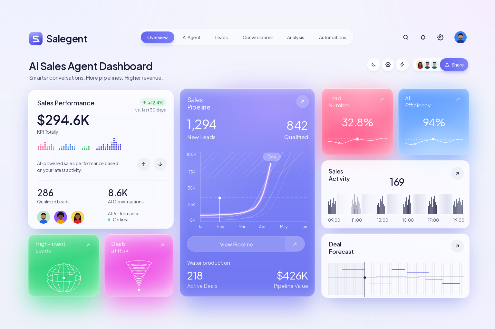
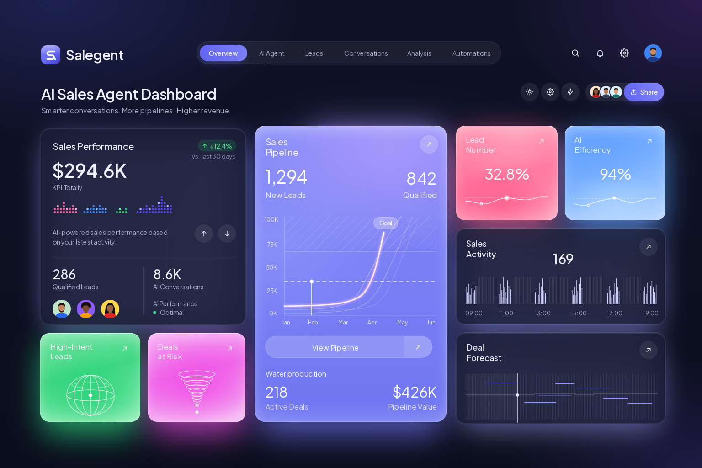
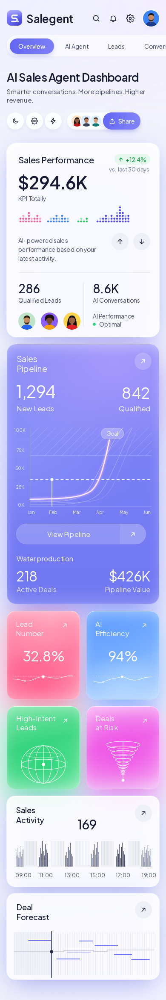
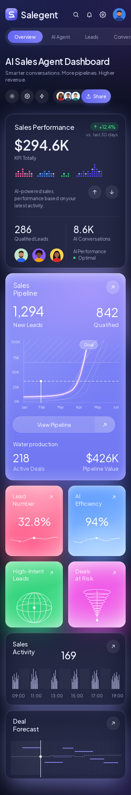

# Salegent · AI Sales Agent Dashboard

A responsive sales dashboard for an AI sales agent, built with **Next.js 16**, **shadcn/ui**
and **Tailwind CSS 4**. Frontend only: mock data, no backend, no auth.

**Live:** https://hrmasss.github.io/salegent-dashboard/





<p align="center">
  
  
</p>

## Features

- Sales performance, pipeline, activity and forecast cards, plus four metric tiles
- Light and dark theme: follows the system by default, remembers an explicit choice
- Responsive from phones to wide desktops, with no horizontal scrolling
- Charts are plain SVG driven by theme tokens, so they switch theme with the rest of the page
- Static export, hosted on GitHub Pages

## Layout

| Width | Layout |
| --- | --- |
| < 768px | One column. The nav pill scrolls sideways inside itself, the toolbar sits under the title. |
| 768 – 1279px | Two columns. Pipeline on the right beside performance and insight tiles; forecast full width at the bottom. |
| 1280 – 1535px | Three columns in fixed proportions; the nav moves inline between brand and account icons. |
| ≥ 1536px | Three columns at full size (450 / 419 / 458px), centered. The layout stops growing here. |

Card placement lives in one file, `src/components/dashboard/dashboard.tsx`, as a CSS grid with
named areas. Each card fills the width its cell gives it and lays its content out in normal flow;
only corner actions are positioned absolutely. Line and bar charts keep their height and stretch
their time axis; the pipeline chart and sparklines scale uniformly.

## Stack

| Concern | Choice |
| --- | --- |
| Framework | Next.js 16, App Router, static export |
| UI primitives | shadcn/ui (Base UI): Button, Badge, Card, Avatar, Separator, restyled |
| Styling | Tailwind CSS 4, design tokens as CSS variables |
| Theme | `next-themes`, `data-theme` on `<html>`, persisted in `localStorage.theme` |
| Font | Plus Jakarta Sans, self-hosted through `next/font` |
| Hosting | GitHub Pages, deployed by GitHub Actions on every push to `main` |

## Getting started

Requires Node 22 and pnpm 10.

```bash
pnpm install
pnpm dev          # http://localhost:3000
pnpm lint
pnpm build        # static site in out/
pnpm preview      # serve out/ on :3000
```

## Project structure

```
src/
├── app/
│   ├── globals.css        Tailwind + shadcn theme, mapped onto the tokens
│   ├── layout.tsx         <html>, font, theme provider
│   └── page.tsx
├── styles/
│   └── tokens.css         all design tokens: colors, shadows, gradients, surfaces
├── config/
│   └── site.ts            name, copy, navigation
├── data/
│   └── dashboard.ts       mock data for every card and chart
└── components/
    ├── ui/                shadcn/ui primitives (restyled variants)
    ├── dashboard/         page composition, one file per card, card glows
    ├── charts/            SVG charts: dot matrix, bars, forecast, pipeline, sparkline
    ├── illustrations/     globe, funnel
    ├── brand/  people/  theme/
    └── icons.tsx          inline SVG icon set
```

## Where to change things

| To change | Edit |
| --- | --- |
| A color, shadow or gradient | `src/styles/tokens.css` (light and dark values sit side by side) |
| A card's surface recipe (glass, pink, sky…) | `src/styles/tokens.css`, `.surface-*` |
| A number, label or chart series | `src/data/dashboard.ts` |
| Title, tagline, nav items | `src/config/site.ts` |
| Where a card sits at each breakpoint | `src/components/dashboard/dashboard.tsx` |
| Button / badge / card variants | `src/components/ui/*` |

Tokens flow one way: `tokens.css` → Tailwind theme in `globals.css` (`text-ink`, `bg-chip`,
`shadow-pill`…) and shadcn semantic colors (`bg-primary`, `border-border`…) → components.
Charts read the same variables through `style={{ fill: "var(--barFg)" }}`, so they follow the theme too.

## Interactions

The theme toggle switches light and dark. With no stored choice the system preference applies;
an explicit choice is saved in `localStorage` and restored on the next visit. Navigation links and
the other buttons are placeholders.

## Deploying

Pushing to `main` runs `.github/workflows/deploy.yml`: install, lint, build with
`NEXT_PUBLIC_BASE_PATH=/<repo>`, then publish `out/` to GitHub Pages. In the repository settings,
Pages must use **GitHub Actions** as its source. Any static host works the same way: build and
serve `out/`.

## License

[MIT](LICENSE)
